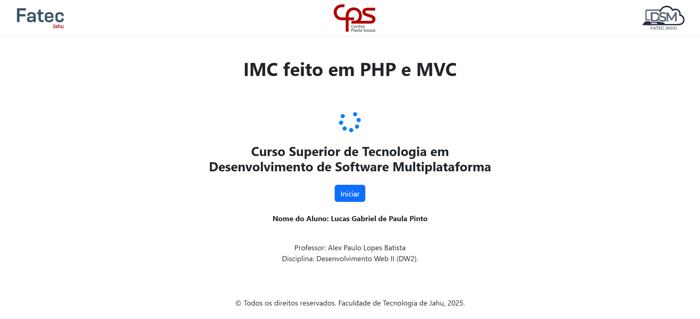
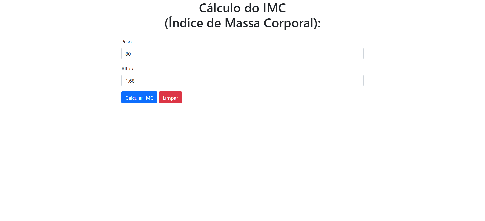
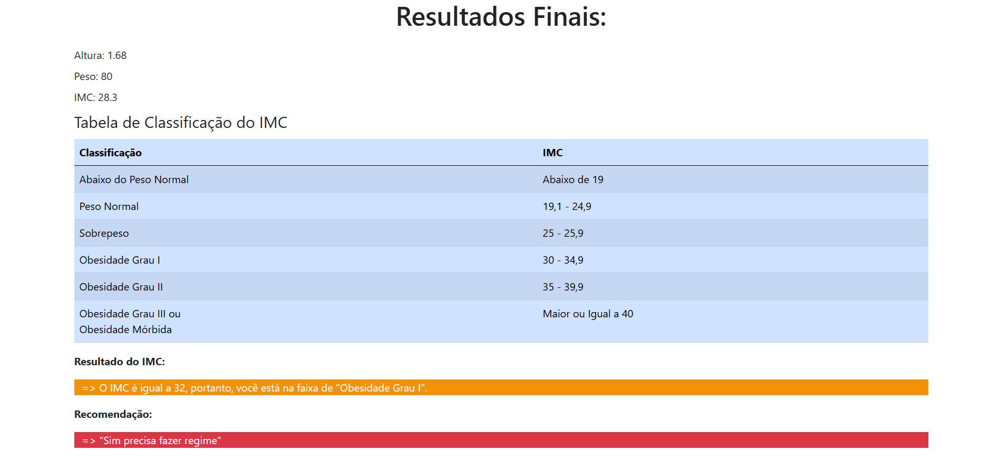

# IMC feito com MVC e PHP

Esse é um projeto da faculdade fatec jau que desenvolvi em PHP com a estrutura MVC para fazer o cálculo de IMC.

  

## Tecnologias utilizadas
<table>
  <tr>
    <td width="50">
      
    </td>
    <td>
      HTML: Estrutura da página web
    </td>
  </tr>

  <tr>
    <td width="50">
      
    </td>
    <td>
      CSS: Estilização da página web
    </td>
  </tr>

  <tr>
    <td width="50">
      
    </td>
    <td>
      PHP: Cálculo e resultado do IMC com MVC
    </td>
  </tr>

</table>